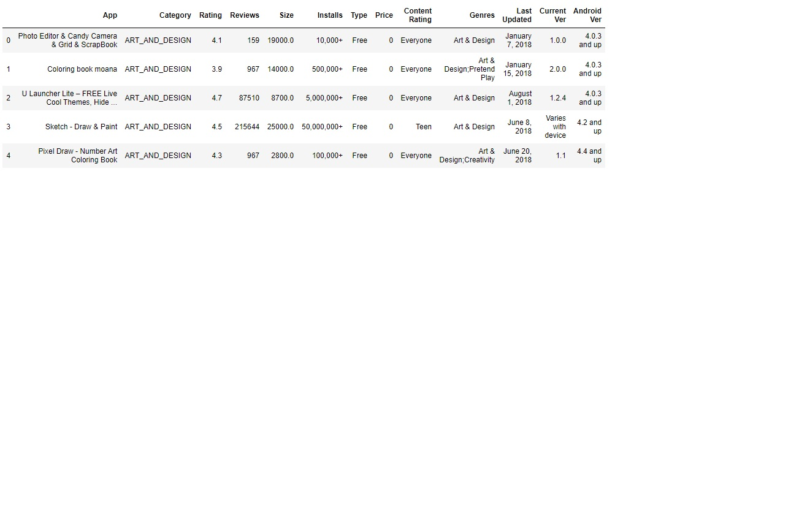

# Analysis-PlayStore-EDA
EDA on Playstore dataset

## Problem Statement

Google Play Store team is about to launch a new feature where in certain apps that are
promising are boosted in visibility. The boost will manifest in multiple ways – higher priority in
recommendations sections (“Similar apps”, “You might also like”, “New and updated games”).
These will also get a boost in visibility in search results. This feature will help bring more
attention to newer apps that have potential.
The task is to understand what makes an app perform well - size? price? category? multiple
factors together? Analyze the data and present your insights in a format consumable by
business – the final output of the analysis would be presented to business as insights with
supporting data/visualizations.

## Video of the Analysis (Click on the image)

## Dataset
 
